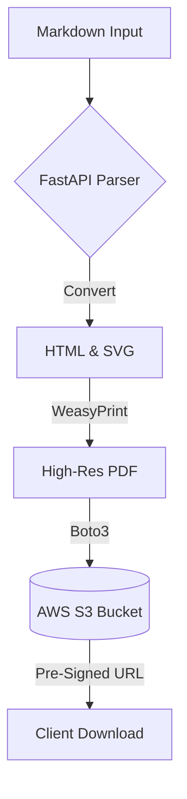

# 📄 MD2PDF: The Ultimate Markdown Exporter

Welcome to MD2PDF. This README serves not only as documentation but as the ultimate stress-test for our Markdown-to-PDF rendering pipeline!

## ✨ Core Features

- **Live Preview**: Real-time rendering with React.
- **Robust S3 Storage**: Secure Cloud integration via Boto3.
- **Advanced Engine**: Powered by WeasyPrint and FastAPI.

---

## 🧮 Advanced Mathematical Rendering (KaTeX)

We support both inline math seamlessly integrated into text, like Euler's identity $e^{i\pi} + 1 = 0$, as well as highly complex block equations isolated for emphasis.

**The Navier-Stokes Equation:**
$$ \rho \left( \frac{\partial \mathbf{v}}{\partial t} + \mathbf{v} \cdot \nabla \mathbf{v} \right) = -\nabla p + \mu \nabla^2 \mathbf{v} + \mathbf{f} $$

---

## 📊 Data Formatting (Tables)

| Model | Accuracy | Training Time | Parameters | Optimization |
| :--- | :---: | :---: | :---: | :---: |
| Model A | 98.2% | 45 mins | 120M | AdamW |
| Model B | 96.5% | 15 mins | 45M | RMSprop |
| Model C | **99.1%** | 2 hours | 350M | SGD |

---

## 🖥️ Code Snippets

```python
def calculate_entropy(probabilities: list[float]) -> float:
    """
    Calculates the Shannon entropy of a given probability distribution.
    """
    import math
    return -sum(p * math.log2(p) for p in probabilities if p > 0)
```

---

## 📈 Mermaid Diagrams

Our system natively intercepts Mermaid syntax, fetches high-resolution SVGs via `mermaid.ink` API, and elegantly embeds them without JavaScript dependencies inside the final PDF wrapper.



---
