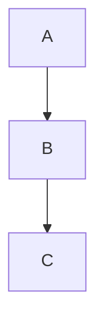

<div align="center">


# MD2PDF

**Convert Markdown into beautiful, print-ready PDFs — instantly.**

[](https://md2pdf-by.shivam007.dev)
[](https://github.com/Shivam007kumar/markdown_to_pdf/stargazers)
[](LICENSE)

</div>

---

## What is MD2PDF?

MD2PDF is a clean, fast, browser-based tool that turns your Markdown into a polished PDF in seconds. Paste your content, tweak the styling with custom CSS, and hit export. That's it.

No accounts. No installs. No friction.

> **Try it live → [md2pdf-by.shivam007.dev](https://md2pdf-by.shivam007.dev)**

---

## Features

- **Live Preview** — See your rendered Markdown update in real time as you type
- **Custom CSS** — Override any style with your own CSS, right in the browser
- **LaTeX Math** — Inline and block math expressions rendered via `$...$` and `$$...$$`
- **Diagrams** — Mermaid, PlantUML, D2, Graphviz, and more via [Kroki](https://kroki.io)
- **GFM Support** — Tables, strikethrough, task lists, and all GitHub Flavored Markdown
- **Syntax Highlighting** — Code blocks rendered with Fira Code on a dark background
- **Mobile Friendly** — Fully responsive with a dedicated mobile editing flow
- **Rate Limited & Secure** — SSRF protection, payload limits, and 10 req/min rate limiting baked in

---

## Tech Stack

| Layer | Technology |
|---|---|
| Frontend | React 18, Vite, Tailwind CSS, CodeMirror 6 |
| Backend | FastAPI, WeasyPrint, markdown-it-py |
| Storage | AWS S3 (presigned URLs for downloads) |
| Diagrams | Kroki API (POST-based, handles large diagrams) |
| Math | LaTeX.codecogs.com (PNG rendering) |
| Rate Limiting | SlowAPI (10 requests/minute per IP) |
| Deployment | AWS EC2 (Graviton), Caddy, Cloudflare Tunnels, GitHub Actions |

---

## How It Works

```
Markdown Input
     │
     ▼
[Diagram blocks] ──► Kroki API ──► Embedded PNG
[Math blocks]    ──► codecogs  ──► Embedded PNG
[Markdown]       ──► markdown-it-py ──► HTML
     │
     ▼
WeasyPrint (HTML + CSS → PDF bytes)
     │
     ▼
Upload to S3 ──► Presigned URL ──► Browser Download
```

1. The frontend sends your Markdown + custom CSS to the `/export` endpoint
2. The backend converts diagrams and math to embedded images first
3. WeasyPrint renders the full HTML+CSS document to PDF
4. The PDF is uploaded to S3 and a short-lived presigned URL is returned
5. Your browser opens the download link automatically

---

## Running Locally

### Prerequisites

- Python 3.11+
- Node.js 18+
- An S3-compatible bucket (AWS S3 or any compatible provider)

### Backend

```bash
cd backend
python -m venv venv
source venv/bin/activate
pip install -r requirements.txt
cp .env.example .env   # fill in your S3 credentials
uvicorn app.main:app --reload --port 8000
```

### Frontend

```bash
cd frontend
npm install
cp .env.example .env   # set VITE_API_URL if needed
npm run dev
```

The app will be available at `http://localhost:5173`.

---

## Environment Variables

### Backend (`backend/.env`)

| Variable | Description |
|---|---|
| `AWS_ACCESS_KEY_ID` | S3 access key |
| `AWS_SECRET_ACCESS_KEY` | S3 secret key |
| `AWS_REGION` | S3 bucket region |
| `S3_BUCKET_NAME` | Target bucket name |

---

## Supported Diagram Types

MD2PDF supports fenced code blocks with the following diagram languages:

````markdown

````

| Language | Renderer |
|---|---|
| `mermaid` | Kroki |
| `plantuml` | Kroki |
| `d2` | Kroki |
| `graphviz` | Kroki |
| `excalidraw` | Kroki |
| `structurizr` | Kroki |

---

## Math Support

Inline math: `$x^2 + y^2 = z^2$`

Block math:
```
$$
\int_0^\infty e^{-x^2} dx = \frac{\sqrt{\pi}}{2}
$$
```

- **Async Rendering:** All math formulas are fetched concurrently in the backend via HTTPX and Asyncio, significantly cutting down PDF generation latency.
- **Scalable Vector Graphics (SVG):** Math is natively rendered into SVGs using LaTeX CodeCogs, allowing for perfectly crisp, layout-mapped physical sizing across both inline and block placements without pixelation.
- **Index-Stable Processing:** Robust regex substitution using UUID placeholders prevents nested parsing conflicts between inline and block math statements.

---

## Security

- **SSRF Protection** — WeasyPrint's URL fetcher is restricted to an explicit allowlist (`kroki.io`, `latex.codecogs.com`, Google Fonts). All `file://` and unknown hosts are blocked.
- **Payload Limits** — Markdown capped at 1MB, CSS at 100KB, generated PDF at 20MB.
- **Rate Limiting** — 10 exports per minute per IP via SlowAPI.
- **No credentials in CORS** — Wildcard origins are used without `allow_credentials`.

---

## Deployment Architecture

The live demo (`md2pdf-by.shivam007.dev`) is fully deployed using a modern, low-cost single-box architecture:

- **Server:** AWS EC2 `t4g.small` (ARM64)
- **Web Server:** Caddy Reverse Proxy
- **Ingress:** Cloudflare Zero Trust Tunnels (No open web ports aside from SSH)
- **Process Manager:** Systemd for Uvicorn background execution
- **CI/CD:** Fully automated via **GitHub Actions** (`.github/workflows/deploy.yml`). Any push to `main` automatically SSHs into the instance, aggressively syncs the codebase, rebuilds the Vite frontend, and restarts the backend API.

---

## Project Structure

```
├── backend/
│   ├── app/
│   │   ├── main.py       # FastAPI app, /export endpoint
│   │   ├── convert.py    # Markdown → HTML (diagrams + math)
│   │   ├── pdf.py        # HTML → PDF via WeasyPrint
│   │   ├── styles.py     # Base CSS + user CSS merging
│   │   └── s3.py         # S3 upload + presigned URL
│   └── tests/            # Phase-based test suite
└── frontend/
    └── src/
        ├── App.jsx        # Main app shell + mobile nav
        └── components/
            ├── Editor.jsx       # CodeMirror markdown editor
            ├── CSSEditor.jsx    # CodeMirror CSS editor
            ├── Preview.jsx      # Live react-markdown preview
            └── ExportButton.jsx # Export trigger + error state
```

---

## Contributing

PRs are welcome. For major changes, open an issue first to discuss what you'd like to change.

---

## Future Scope

As MD2PDF grows, here are the planned features for the next major iterations:

1. **User Authentication & Cloud Sync:** Introduce lightweight user accounts (via NextAuth or Supabase) to permanently save documents in the cloud without relying on local browser storage.
2. **Template Library:** Provide a selection of pre-built CSS templates (e.g., Academic Paper, Minimal Resume, Corporate Report) that users can apply with a single click.
3. **Collaboration:** Add real-time multiplayer editing using WebSockets or Yjs, allowing multiple users to edit the same Markdown document simultaneously.
4. **Custom Headers & Footers:** Allow users to inject dynamic page numbers, dates, and custom text into the PDF margins using WeasyPrint `@page` rules.

---

## Changelog & Recent Updates

- **v1.3.0** — **The Bulletproof Server Update**
  - **Math Edge-Case Protection:** Implemented a pre-processor masking strategy for code blocks. Shell scripts and code variables (like `$HADOOP_HOME`) are now perfectly shielded from the LaTeX regex parser, entirely eliminating the 40-second timeout bug.
  - **Comprehensive Health Check System:** Built a zero-maintenance Python cron script that pings the live server daily. On Sundays at midnight, it goes a step further: it dynamically generates a rich Markdown payload (with LaTeX and Mermaid diagrams), hits the E2E `/export` API, downloads the resulting PDF, and emails it to the admin. This conclusively proves the entire pipeline (Parser -> CodeCogs -> Kroki -> WeasyPrint -> S3 -> Email) is 100% operational.
  - **Proxy Rate-Limit Fix:** Configured Uvicorn to parse `X-Forwarded-For` headers (`--proxy-headers`), fixing a bug where SlowAPI globally rate-limited the entire application due to Cloudflare/Caddy IP masking.

- **v1.2.0** — **The "Never Lose Work" Update**
  - **IndexedDB Auto-Save:** Implemented seamless, silent background auto-saving using `localforage`. Your drafts (Markdown, CSS, and images) survive tab closures, refreshes, and browser crashes.
  - **"Google Docs" Style Indicators:** Added live "Saving..." and "Saved locally" indicators to the top header for complete peace of mind.
  - **Responsive A4 Editor:** Configured CodeMirror to automatically wrap lines and intelligently cap the width (`max-w-4xl`) on large monitors to mimic an A4 PDF document, while remaining fluid on mobile devices.
  - **Clear Document Workflow:** Added a handy "Clear" button to quickly purge local storage and start fresh.

- **v1.1.0** — **The Math Polish Update**
  - **SVG Math Architecture:** Replaced legacy high-DPI PNG rendering for math formulas with scalable SVGs. This fully resolved all pixel layout sizing bugs and CSS scaling issues natively within WeasyPrint.
  - **Robust Regex Parsing:** Implemented sequential UUID placeholders in `app/convert.py` to fix regex overlap bugs, fully supporting nested block and inline math without HTML corruption.
  - **Async Fetching:** Built out `asyncio.gather` logic for LaTeX formula fetching, dropping PDF generation time.
  - **Automated Deployment Sync:** Fully synced GitHub Actions CI/CD to AWS EC2 so every GitHub push instantly mirrors to production.

---

<div align="center">

If MD2PDF saves you time, a ⭐ on GitHub goes a long way.

**[Star the repo →](https://github.com/Shivam007kumar/markdown_to_pdf)**

</div>
